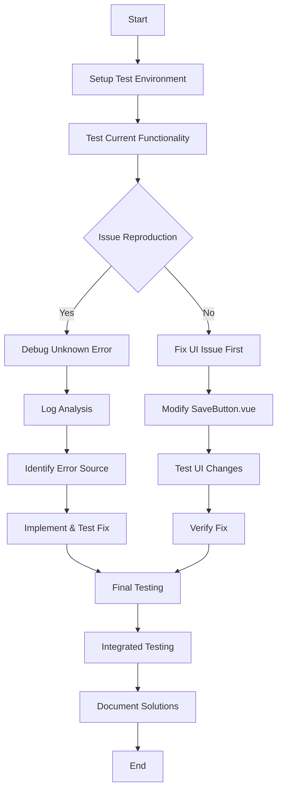

# DiceBear Manual Save Integration Debugging Plan

After analyzing the DiceBear codebase, I've identified the root issues and prepared a comprehensive plan to address the manual save functionality problems. Let's focus on a systematic approach to fix both issues.

## Issue Analysis

### Issue 1: Overlapping "Unsaved Changes" Notification
- The notification is currently positioned using `position: absolute` with `top: -16px; right: 0` which causes it to overlap with other elements
- It's displayed using a `v-if="hasUnsavedChanges"` directive in the SaveButton.vue component
- The save button already implements proper disable/enable state based on the hasUnsavedChanges value

### Issue 2: "UNKNOWN ERROR" on Save
Potential causes:
- Token validation issues in the backend
- Error handling in the serverAdapter.ts saveToServer function
- Network communication problems
- Data format issues when sending to the server

## Testing & Debugging Plan



## Detailed Implementation Plan

### Phase 1: Setup & Initial Testing

1. **Setup Test Environment**
   - Start the DiceBear server and editor
   - Use the test-manual-save.html page to create a testing session

2. **Reproduce and Document Issues**
   - Generate a test token and open the editor
   - Make changes to the avatar and observe the UI issues
   - Attempt to save and capture the exact error message and console logs

### Phase 2: Fix UI Issue (Overlapping Notification)

1. **Modify SaveButton.vue**
   - Remove the "unsaved changes" notification div element entirely
   - Enhance the save button's visual state to better indicate when changes can be saved:
     - When disabled (no changes): Use a muted/gray color
     - When enabled (unsaved changes): Use a prominent color (e.g., warning/orange)

2. **CSS Adjustments**
   - Remove the CSS for the unsaved-changes-indicator
   - Update the save button styling to make its enabled/disabled states more visually distinct

### Phase 3: Debug & Fix the Save Error

1. **Error Analysis**
   - Add comprehensive logging to identify where the error occurs
   - Check browser console for errors during save attempts
   - Verify network requests and responses
   - Examine token validation in the backend

2. **Implement Fixes Based on Findings**
   - Potential fixes based on probable causes:
     - If token validation issue: Fix validateAndConsumeEditToken in db.ts
     - If data formatting issue: Update the request payload in serverAdapter.ts
     - If error handling issue: Improve error handling in saveToServer
     - If server-side issue: Fix the logic in editor.ts endpoint

### Phase 4: Testing & Validation

1. **Test Each Fix Individually**
   - Test UI changes with both states (with/without unsaved changes)
   - Test save functionality after fixing the error
   - Verify token handling works correctly

2. **Integrated Testing**
   - Complete an end-to-end test of the manual save workflow
   - Verify both issues are resolved together
   - Test edge cases (e.g., rapid changes, large option objects)

## Specific Code Changes

### 1. SaveButton.vue Changes

```diff
// In template section
- <div v-if="hasUnsavedChanges" class="unsaved-changes-indicator">Unsaved changes</div>

// In style section
- .unsaved-changes-indicator {
-   position: absolute;
-   background-color: #ff9800;
-   color: white;
-   border-radius: 4px;
-   padding: 2px 6px;
-   font-size: 0.7em;
-   top: -16px;
-   right: 0;
-   animation: fadeIn 0.3s ease-in-out;
- }
-
- @keyframes fadeIn {
-   from { opacity: 0; }
-   to { opacity: 1; }
- }
```

### 2. Debugging Error Issue

Add strategic logging to identify the source of the error:

```javascript
// In serverAdapter.ts saveToServer function
try {
  console.log('Save payload:', {
    userId,
    token: token.substring(0, 5) + '...',  // Log part of token for security
    style,
    options
  });
  
  const response = await fetch(`/api/editor/${userId}`, {
    // ...
  });
  
  console.log('Save response status:', response.status);
  // Further logging...
}
```

### 3. Server-side Logging

```javascript
// In editor.ts POST endpoint
try {
  const { userId } = req.params;
  const { token, style, options } = req.body;
  
  console.log(`Editor save request details:`, {
    userId,
    tokenProvided: !!token,
    styleProvided: !!style,
    optionsType: typeof options,
    optionsIsArray: Array.isArray(options)
  });
  
  // Additional logging throughout the function...
}
```

## Token Handling Analysis

One likely cause of the "UNKNOWN ERROR" could be token consumption issues. In the current implementation, `validateAndConsumeEditToken` in db.ts is called during save operations, which deletes the token after use.

Possible issues to examine:
1. Token validation failing due to incorrect or expired token
2. Token being consumed even when there's an error in the save process
3. Frontend not receiving or correctly handling token expiration notices

## Success Criteria

1. The "unsaved changes" notification no longer appears anywhere in the UI
2. The save button clearly shows when it's enabled (changes to save) vs. disabled (no changes)
3. Clicking the save button successfully saves changes without errors
4. After saving, the button returns to disabled state until new changes are made